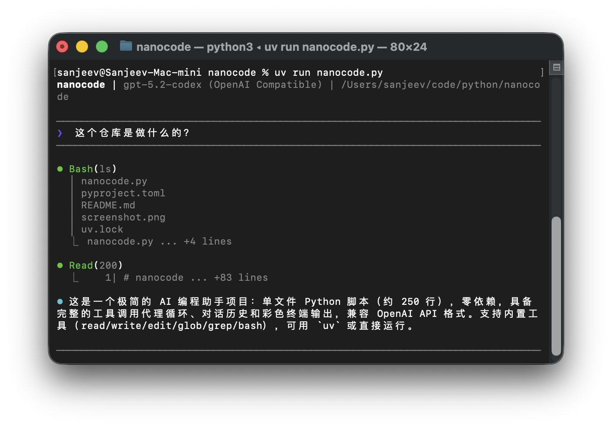

# nanocode

极简的 AI 编程助手。单文件 Python 脚本，仅约 250 行代码。
最初基于 Claude Code 构建，随后用于构建自身。



## 特性

- 完整的工具调用代理循环 (Agentic Loop)
- 内置工具：`read` (读取), `write` (写入), `edit` (编辑), `glob` (文件查找), `grep` (搜索), `bash` (终端命令)
- 对话历史记录
- 彩色终端输出
- 兼容 OpenAI API 格式

## 快速开始

### 使用 uv 启动 (推荐)

使用 `uv` 可以自动管理环境，无需手动安装依赖。

直接运行：

```bash
uv run nanocode.py
```

或者将其作为工具安装：

```bash
uv tool install .
nanocode
```

### 手动运行

需要 Python 3 环境。

```bash
pip install -r requirements.txt

python nanocode.py
```

## 环境变量配置

程序通过环境变量进行配置，推荐在项目根目录下创建 `.env` 文件。

| 变量名 | 说明 | 默认值 |
|--------|------|--------|
| `OPENAI_API_KEY` | **必须**。OpenAI 格式的 API 密钥 | 无 |
| `API_URL` | API 请求地址 | `https://api.openai.com/v1/chat/completions` |
| `MODEL` | 使用的模型名称 | `gpt-5.2-codex` |

**示例 `.env` 文件：**

```env
API_URL=https://api.openai.com/v1/chat/completions
OPENAI_API_KEY=
MODEL=gpt-5.2-codex
```

## 命令

- `/c` - 清除当前对话历史
- `/q` 或 `exit` - 退出程序

## 工具列表

| 工具 | 说明 |
|------|-------------|
| `read` | 读取文件内容（支持行号、偏移量/限制） |
| `write` | 写入内容到文件（覆盖） |
| `edit` | 替换文件中的字符串（需保证查找字符串唯一） |
| `glob` | 按模式查找文件（按修改时间排序） |
| `grep` | 使用正则搜索文件内容 |
| `bash` | 执行 Shell 命令 |

## 许可证

MIT
